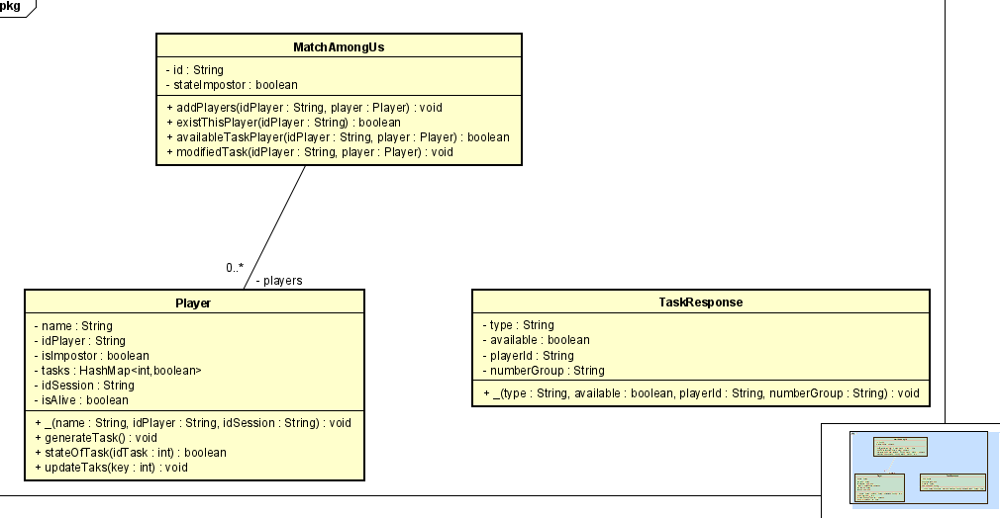
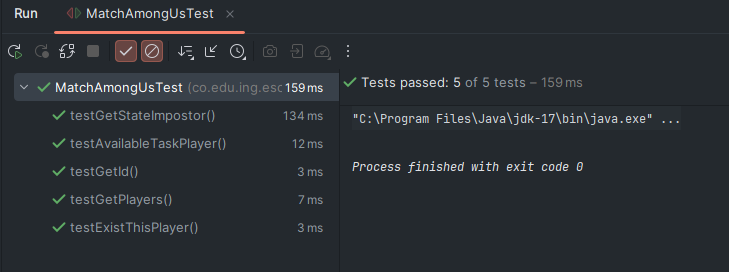
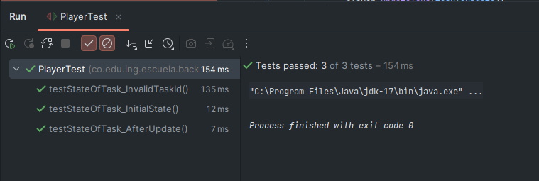

# Emulator Among Us Backend
This is the Backend of Emulator Among Us with the front build and compile in the [/src/resource/public](#).

[Repository in GitHub here.](https://github.com/JffMv/Emulator-Among-Us-Back)

## Getting Started

For clone this repository you use this command:
 ```
 git clone https://github.com/JffMv/Emulator-Among-Us-Back.git
 ```

### Prerequisites

Have installed:
maven 3.9.6 - [Install Maven](https://maven.apache.org/download.cgi#Installation)

git 2.44 - [Install Git](https://git-scm.com/book/en/v2/Getting-Started-Installing-Git)

java - [Install Java](https://www.oracle.com/co/java/technologies/downloads/)


## Deployment

The process were building project maven with the command:

```
mvn archetype:generate -DgroupId=org.example -DartifactId=CALCULATOR -DarchetypeArtifactId=maven-archetype-quickstart -DinteractiveMode=false

```

Then we have verify the class App.java and the pom.xml, run the project with:

```
mvn package
```


For generate documentation update the pom.xml add and later use "mvn package":

```
<reporting>
    <plugins>
    <plugin>
    <groupId>org.apache.maven.plugins</groupId>
    <artifactId>maven-javadoc-plugin</artifactId>
    <version>2.10.1</version>
    <configuration>
    </configuration>
    </plugin>
    </plugins>
</reporting>
```


## Architecture


### AmongEndPoint:
This is the component that keep the connection, because is here where is the websocket.
Implementation essential for establish the constant in time real and concurrent.

### BackAmongUsApplications
Is the class principal where is the main and the getPort, that identify the port for where run the application.
### AmongConfigurator:
Configuration for the Endpoint work, because normally this service of endpoint is close for Spring and this configuration available this service.

## Classes Design


### class - MatchAmongUs:
This class know all information of the one match in time real, can be SINGLETON, however this implementation not have.


### class - Player
This class know all information of the one player in time real.

### class - TaskResponse:
This class is used like format for sent to client response when ask for the task.

## Test
if you want run of test use this command:
```
mvn test
```
Test of the class MatchAmongUs

Test of the class Player



## Built With

* [Java](https://www.java.com/es/) - The language used
* [Maven](https://maven.apache.org/) - Dependency Management
* [React](https://reactjs.org/) - Frontend framework
* [Git](http://git-scm.com/) - Version Control System


## Authors

* **Yeferson Mesa**

## License

This project is licensed under the MIT License - see the [LICENCE.txt](LICENCE.txt) file for details